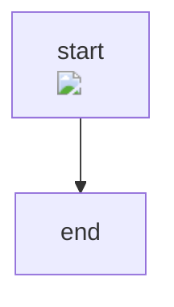

<!-- Fixture for test_render_html.sh. Every payload below tries to overwrite document.title with PWNED; none may run. -->

# Report </title>

Normal **bold** text and `code`.

</script>

```mermaid
graph TD
  A["start <img src=x onerror=document.title='PWNED-mermaid'>"] --> B[end]
```
